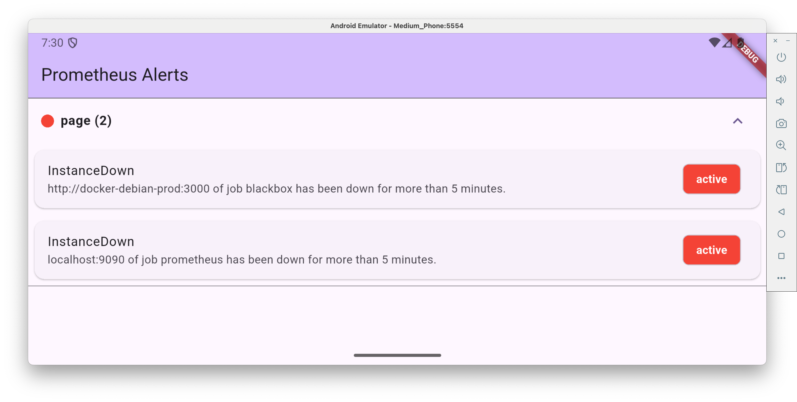

# flutter_application_alertmanager

A simple [Flutter](https://flutter.dev/) app to fetch and display [Prometheus® Alertmanager](https://prometheus.io/docs/alerting/alertmanager/) alerts from its REST API.

*Not affiliated with the official Prometheus® Alertmanager project.*

## Requirements

- Flutter SDK >= 3.8.1
- An accessible Alertmanager instance >= 0.28.1

## Legal Disclaimer

This project is an independent, open-source application developed to interact with the [Prometheus® Alertmanager](https://prometheus.io/docs/alerting/alertmanager/) API.

It is **NOT** affiliated with, endorsed by, or officially supported by the [Prometheus®](https://prometheus.io/) Authors, [The Linux Foundation®](https://training.linuxfoundation.org/training/monitoring-systems-and-services-with-prometheus-lfs241/), the [Cloud Native Computing Foundation®](https://www.cncf.io/projects/prometheus/) (CNCF®), or any of their related proejcts or organizations.

“Prometheus®” is a registered trademark of their respective owners. Use of this name is for informational purposes only.

## Developing

Once you've installed dependencies with `flutter pub get` start the app using `flutter run`.
